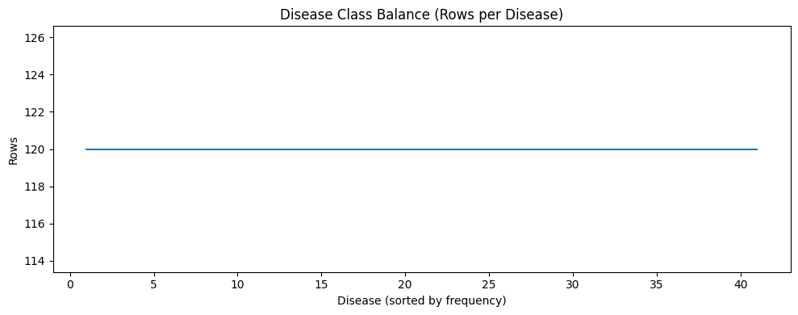
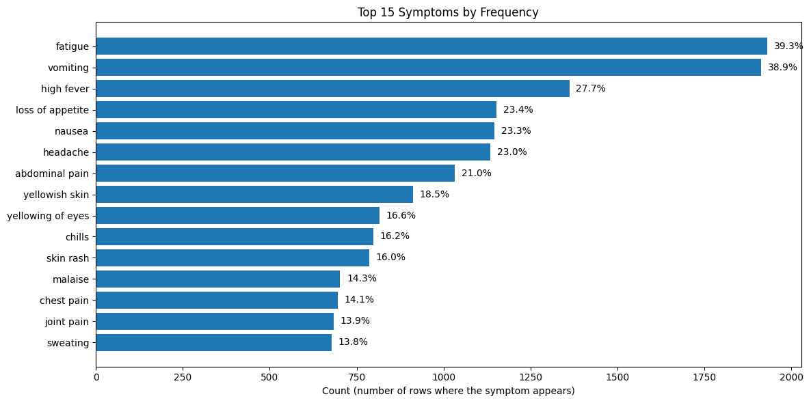
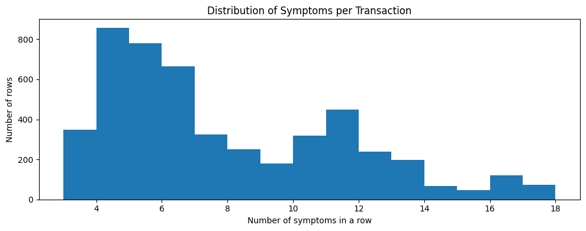
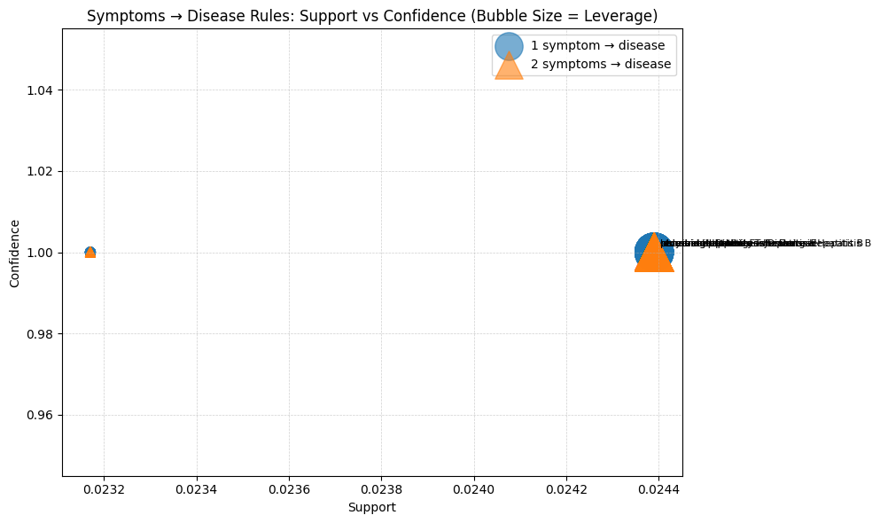
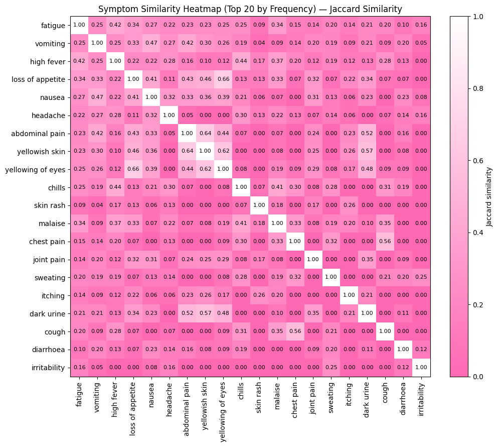
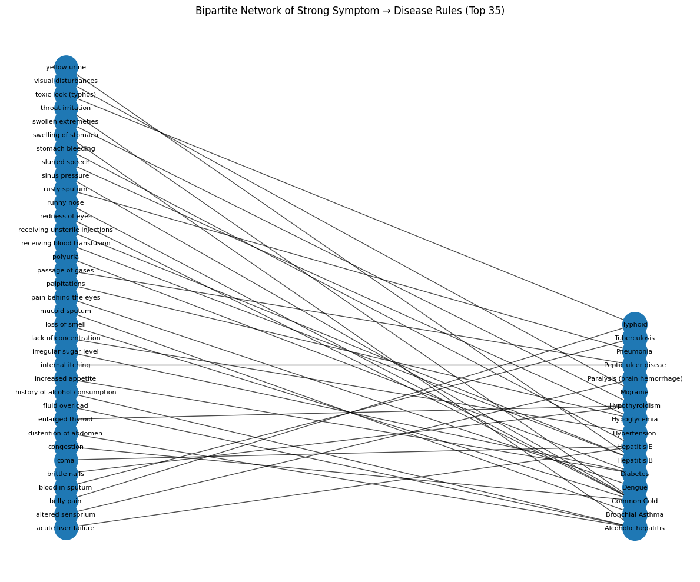

# Explainable Disease–Symptom Pattern Mining with Apriori Association Rules
**CSC172 Data Mining and Analysis Final Project**  
*Mindanao State University – Iligan Institute of Technology*  
**Student:** Joshua Radz T. Adlaon (2022-2534)  
**Semester:** AY 2025–2026 | Sem 1  

> **Disclaimer:** This work is for **educational and data-mining purposes only**. The mined association rules describe **patterns present in the dataset** and must not be interpreted as medical diagnosis, treatment advice, or clinical truth.

---

## Abstract

Symptom–disease datasets can be naturally modeled as **transactions**: each record becomes a “basket” of symptoms associated with a disease label. However, interpretation is not straightforward. Many symptoms are **non-specific** (e.g., fatigue, fever, nausea) and overlap across multiple diseases, so looking at symptoms individually often fails to explain meaningful structure. While predictive models can output a disease label, they may not provide the **transparent reasoning** needed for reporting, classroom defense, and stakeholder-friendly explanation. In contrast, Association Rule Mining (ARM) generates human-readable **IF–THEN** rules and quantifies their strength through standard quality measures.

This project applies an **Apriori-style frequent pattern mining workflow** to the Kaggle Disease–Symptom dataset (`dataset.csv`). Each row is treated as a transaction, and two complementary knowledge views are mined. First, the project discovers **Symptom → Symptom** rules to reveal stable co-occurrence patterns and symptom clusters—useful for understanding dataset structure without relying on prediction. Second, the project enables **Class Association Rules (CARs)** by appending the disease label as a heterogeneous item (`disease::<DiseaseName>`), allowing the mining of **Symptoms → Disease** rules directly within the ARM framework. This dual design supports both structural insight (symptom clustering) and class-linked insight (symptom signatures associated with diseases).

To ensure the outputs are presentation-ready, the workflow includes careful token standardization, reproducible transaction construction, interpretable itemset limits (up to 3-itemsets), ranked rule tables, and a set of visuals that communicate both dataset structure and rule behavior. Rules are evaluated using **support, confidence, lift, and leverage**, with leverage emphasized to provide a grounded view of improvement beyond chance—particularly important in a dataset with perfectly balanced disease classes. Overall, the project demonstrates an explainable, defensible ARM pipeline capable of extracting meaningful transactional structure from categorical symptom data in a way that is easy to validate and communicate.

---

## Table of Contents
- [Abstract](#abstract)
- [Introduction](#introduction)
  - [Problem Statement](#problem-statement)
  - [Objectives](#objectives)
  - [Scope and Limitations](#scope-and-limitations)
- [Dataset Description](#dataset-description)
  - [Source](#source)
  - [Schema](#schema)
  - [Dataset Statistics](#dataset-statistics)
- [Methodology](#methodology)
  - [1) Data Cleaning and Standardization](#1-data-cleaning-and-standardization)
  - [2) Transaction Construction](#2-transaction-construction)
  - [3) Apriori-Style Mining Strategy (k ≤ 3)](#3-apriori-style-mining-strategy-k--3)
  - [4) Rule Generation](#4-rule-generation)
  - [5) Rule Quality Metrics](#5-rule-quality-metrics)
  - [6) Visualization Design](#6-visualization-design)
  - [Reproducibility (How to Run)](#reproducibility-how-to-run)
- [Exploratory Data Analysis](#exploratory-data-analysis)
- [Results](#results)
  - [Mining Summary](#mining-summary)
  - [A) Symptom → Symptom Rules](#a-symptom--symptom-rules)
  - [B) Symptoms → Disease Rules (Class Association Rules)](#b-symptoms--disease-rules-class-association-rules)
  - [C) Cross-Pattern Structure (Similarity + Network)](#c-cross-pattern-structure-similarity--network)
- [Discussion](#discussion)
  - [Key Insights](#key-insights)
  - [Why Some Rules Look “Too Perfect”](#why-some-rules-look-too-perfect)
  - [Limitations](#limitations)
  - [Future Improvements](#future-improvements)
- [Conclusion](#conclusion)
- [Video Presentation](#video-presentation)

---

## Introduction

### Problem Statement

Disease–symptom data is typically recorded as a disease label plus a list of symptoms. This format is easy to store but difficult to interpret because:

1. **Symptoms overlap heavily across conditions.** Many symptoms are shared by multiple diseases. Individually, a symptom often provides weak explanatory value; what matters is the **combination** of symptoms and whether consistent co-occurrence patterns exist.
2. **Explainability matters more than prediction for this task.** A predictive model can output a label, but a final project must also demonstrate:  
   *What patterns exist? How strong are they? Why should we trust them as data-driven evidence?*
3. **Token noise can distort frequent pattern mining.** Small text inconsistencies (underscores, repeated spaces, duplicates, empty symptom slots) fragment the item space, producing misleading counts and weaker rules.
4. **We need interpretable disease-linked patterns without black-box logic.** The goal is not only to find symptom clusters, but also to discover symptom combinations that align with disease labels, while remaining transparent and measurable.

This project addresses the following explainability-centered mining question:

> **How can we extract strong, human-readable symptom patterns that (a) reveal stable symptom co-occurrence structure and (b) produce interpretable symptom → disease associations, using a defensible Apriori-style Association Rule Mining workflow?**

### Objectives

- Build an end-to-end ARM workflow that converts the raw disease–symptom table into a clean transaction database suitable for frequent pattern mining.
- Perform systematic **symptom token cleaning and standardization** to prevent item fragmentation and preserve correct frequency counts.
- Construct **two transaction views**:
  - **Symptoms-only transactions** for Symptom → Symptom pattern mining,
  - **Heterogeneous transactions** by appending `disease::<DiseaseName>` to support **Symptoms → Disease** (CAR-style) mining.
- Apply an **Apriori-style bounded mining strategy** (k ≤ 3) to balance runtime feasibility with presentation clarity and interpretability.
- Generate association rules and evaluate them using **support, confidence, lift, and leverage**.
- Produce presentation-ready outputs: ranked rule tables + visuals that summarize dataset structure and rule behavior.

### Scope and Limitations

**Scope**
- Explainable pattern mining using Apriori-style frequent itemsets (k ≤ 3).
- Two rule families:
  - **Symptom → Symptom** co-occurrence rules,
  - **Symptoms → Disease** rules using heterogeneous disease items (`disease::<...>`).
- Rule evaluation and interpretation using standard ARM metrics and clear visualizations.

**Limitations**
- The dataset is **perfectly class-balanced** (120 rows per disease). This can inflate **lift** for confidence=1.0 disease rules; **leverage** is reported to show absolute improvement beyond chance.
- ARM captures **co-occurrence**, not causality. Strong rules do not prove medical relationships.
- Symptoms are treated as **binary presence/absence** with no severity, timing, or patient context.
- Findings reflect patterns specific to this dataset and may not generalize to real clinical data.

---

## Dataset Description

### Source
Kaggle: **Disease Symptom Description Dataset**  
Dataset link: https://www.kaggle.com/datasets/itachi9604/disease-symptom-description-dataset  
(Used file: `dataset.csv`)

### Schema

| Column | Description |
|---|---|
| `Disease` | Disease label (class) |
| `Symptom_1` … `Symptom_17` | Symptom tokens (strings), many rows have fewer than 17 valid symptoms |

### Dataset Statistics

- **Rows (transactions):** 4,920  
- **Diseases (classes):** 41  
- **Rows per disease:** 120 each (perfectly balanced)  
- **Unique symptoms:** 131  
- **Symptoms per transaction:** min = 3, max = 17, average ≈ 7.45  

---

## Methodology

Implementation is split across two notebooks:
- `data_cleaning_standardization.ipynb` — cleaning/standardization + cleaned outputs  
- `arm.ipynb` — EDA + Apriori-style counting + rule generation + evaluation + visuals

### 1) Data Cleaning and Standardization

ARM is token-sensitive: one symptom written in two formats becomes two different items. Cleaning ensures a consistent item space:

- **Symptom token normalization**
  - trim whitespace,
  - convert to lowercase,
  - replace underscores `_` with spaces,
  - collapse repeated spaces,
  - remove null/empty symptom fields,
  - remove duplicates within each row (transaction set behavior).
- **Disease label cleaning**
  - strip leading/trailing whitespace while preserving naming.

This produces transactions where each symptom is a clean, stable item (e.g., `skin_rash` → `skin rash`).

### 2) Transaction Construction

Each dataset row becomes a transaction (basket). Two views are constructed:

1) **Symptoms-only transactions**  
   `T = {symptom_1, symptom_2, ...}`  
   Used for **Symptom → Symptom** rules.

2) **Heterogeneous transactions** (Symptoms + Disease-as-Item)  
   `T' = {symptom_1, symptom_2, ..., disease::<DiseaseName>}`  
   Used for **Symptoms → Disease** rules (Class Association Rules within an ARM framework).

### 3) Apriori-Style Mining Strategy (k ≤ 3)

This project uses an **Apriori-style bounded frequent itemset approach**:
- Count itemsets of size **1**, **2**, and **3** from each transaction.
- Apply **minimum support pruning** using the Apriori intuition that infrequent patterns should be discarded.
- Stop at **k ≤ 3** to keep patterns interpretable for presentation.

This bounded strategy is appropriate here because:
- basket sizes average ~7–8 symptoms, making enumeration feasible,
- pairs and triples are easy to defend and interpret,
- larger itemsets tend to become overly specific and harder to communicate.

**Thresholds**
- Symptom → Symptom mining:  
  `min_support_ss = 0.03` → min count ≈ `ceil(0.03 × 4920) = 148`  
  `min_confidence_ss = 0.50`

- Symptoms → Disease mining:  
  `min_support_sd = 0.02` → min count ≈ `ceil(0.02 × 4920) = 99`  
  `min_confidence_sd = 0.40`

### 4) Rule Generation

**A) Symptom → Symptom rules**
- From frequent pairs `{A, B}`: generate `A → B` and `B → A`.
- From frequent triples `{A, B, C}`: generate two-symptom antecedent rules:  
  `{A, B} → C`, `{A, C} → B`, `{B, C} → A`.

**B) Symptoms → Disease rules (CAR-style)**
Rules are constrained so the consequent is always a disease item:

- From `{symptom, disease::<X>}` → `symptom → disease::<X>`
- From `{symptom1, symptom2, disease::<X>}` → `{symptom1, symptom2} → disease::<X>`

This ensures the CAR set remains interpretable and aligned with the disease label objective.

### 5) Rule Quality Metrics

For each rule `X → Y`:
- **Support:** `P(X ∪ Y)`  
- **Confidence:** `P(Y | X)`  
- **Lift:** `confidence / P(Y)`  
- **Leverage:** `P(X ∪ Y) − P(X)P(Y)`

Leverage is included to avoid over-interpreting high lift values caused by the dataset’s balanced class priors.

### 6) Visualization Design

Visuals are selected to support both analysis and presentation:
- Symptom dominance (Top symptom frequency)
- Transaction structure (Symptoms per transaction distribution)
- Symptom similarity structure (Jaccard similarity heatmap)
- Rule landscape (Support vs confidence bubble plot, sized by leverage)
- Structural interpretability (Bipartite symptom–disease network)

### Reproducibility (How to Run)

**Requirements**
- Python 3.9+ recommended
- Jupyter Notebook / JupyterLab

**Install dependencies**
```bash
python -m pip install pandas numpy matplotlib networkx
```

**Run order**
1. Open and run: `data_cleaning_standardization.ipynb`  
2. Open and run: `arm.ipynb`

**Recommended folder layout**
```
.
├── dataset.csv
├── data_cleaning_standardization.ipynb
├── arm.ipynb
└── assets/
    ├── disease_class_balance.png
    ├── top15_symptoms.png
    ├── distribution_of_symptoms.png
    ├── jaccard_similarity.png
    ├── support_vs_conf.png
    └── Bipartite_Network.png
```

---

## Exploratory Data Analysis

EDA motivates mining choices by showing symptom dominance, class balance, and transaction size.

<!-- REQUIRED VISUAL (arm.ipynb): Title = "Disease Class Balance (Rows per Disease)" -->


<!-- REQUIRED VISUAL (arm.ipynb): Title = "Top 15 Symptoms by Frequency" -->


<!-- REQUIRED VISUAL (arm.ipynb): Title = "Distribution of Symptoms per Transaction" -->


EDA highlights:
- The dataset is perfectly class-balanced (120 rows per disease).
- Several symptoms are frequent across many diseases, motivating multi-symptom rules.
- Basket size is moderate (≈7–8 symptoms), making bounded frequent itemset mining feasible and interpretable.

---

## Results

### Mining Summary

| Component | Configuration | Output |
|---|---|---:|
| Symptom → Symptom | min_support=0.03 (≥148), min_conf=0.50 | **1,025 rules** |
|  |  | 143 single-antecedent, 882 two-antecedent |
| Symptoms → Disease (CAR) | min_support=0.02 (≥99), min_conf=0.40 | **1,006 rules** |
|  |  | 120 single-symptom, 886 two-symptom |
| Disease coverage (CAR rules) | under current thresholds | **39 / 41 diseases** |
| Diseases not covered (CAR) | under current thresholds | **Heart attack**, **Hepatitis D** |

> Interpretation note: missing diseases under CAR thresholds can occur when no symptom or symptom-pair appears frequently enough (≥99 rows) within that disease’s 120 records to pass support + confidence constraints.

---

### A) Symptom → Symptom Rules

These rules describe stable co-occurrence structure—symptom clusters that repeatedly appear together across transactions.

**Examples (high confidence + strong leverage):**

| Antecedent | Consequent | Support | Confidence | Lift | Leverage |
|---|---|---:|---:|---:|---:|
| yellowing of eyes | loss of appetite | 0.1598 | 0.9632 | 4.1138 | 0.1209 |
| yellowish skin | abdominal pain | 0.1549 | 0.8355 | 3.9833 | 0.1160 |
| nausea | vomiting | 0.1988 | 0.8534 | 2.1937 | 0.1082 |
| abdominal pain | vomiting | 0.1768 | 0.8430 | 2.1670 | 0.0952 |
| high fever | fatigue | 0.1988 | 0.7181 | 1.8286 | 0.0901 |

**Interpretation (what these patterns show):**
- The **yellowing of eyes / yellowish skin / appetite issues** rules form a coherent cluster that behaves like a strong dataset signature.
- The **nausea–vomiting–abdominal pain** group reflects a frequent gastrointestinal co-occurrence structure.
- Rules like **high fever → fatigue** capture common systemic patterns that appear across multiple conditions.

**Why this matters for an ARM project:** these rules provide dataset structure discovery that is **transparent**, **measurable**, and **easy to validate** directly through counts.

---

### B) Symptoms → Disease Rules (Class Association Rules)

By appending the disease label as an item (`disease::<DiseaseName>`), the project mines explainable symptom signatures linked to disease classes.

**Examples (single-symptom signature rules):**

| Symptom | Disease | Support | Confidence | Lift |
|---|---|---:|---:|---:|
| increased appetite | Diabetes | 0.0244 | 1.0000 | 41.0 |
| polyuria | Diabetes | 0.0244 | 1.0000 | 41.0 |
| pain behind the eyes | Dengue | 0.0244 | 1.0000 | 41.0 |
| receiving blood transfusion | Hepatitis B | 0.0244 | 1.0000 | 41.0 |
| blood in sputum | Tuberculosis | 0.0244 | 1.0000 | 41.0 |

**What these rules mean in this dataset**
- Support ≈ 0.0244 corresponds to 120/4920 rows, reflecting that the symptom appears across the full set of a disease’s records (or nearly so).
- Confidence = 1.0 means: within this dataset, whenever the symptom appears, it is always paired with that disease label.

**Rule-quality view (distribution of rule strength):**  
<!-- REQUIRED VISUAL (arm.ipynb): Bubble plot title = "Symptoms → Disease Rules: Support vs Confidence (Bubble Size = Leverage)" -->


How to read it:
- Upper-right rules are both frequent and reliable.
- Bubble size emphasizes leverage so “meaningful” improvements stand out.

---

### C) Cross-Pattern Structure (Similarity + Network)

**1) Symptom similarity (Jaccard heatmap)**  
This visual explains symptom clustering beyond isolated rules by measuring how similarly symptoms co-occur with other symptoms.

<!-- REQUIRED VISUAL (arm.ipynb): Title = "Symptom Similarity Heatmap (Top 20 by Frequency) — Jaccard Similarity" -->


Why it matters:
- Rules show local IF–THEN links.
- Similarity heatmaps show global structure (clusters of symptoms with shared co-occurrence partners).

**2) Bipartite symptom–disease network**  
This visual summarizes the strongest symptom→disease connections for presentation.

<!-- REQUIRED VISUAL (arm.ipynb): Title = "Bipartite Network of Strong Symptom → Disease Rules (Top 35)" -->


Why it matters:
- It communicates results quickly to non-technical viewers.
- It shows whether diseases are strongly linked by shared symptoms or separated by distinctive signatures.

---

## Discussion

### Key Insights

**1) ARM separates general symptoms from signature structure.**  
Highly frequent symptoms tend to appear across many diseases, which reduces their specificity. ARM reveals that meaningful interpretability often comes from **combinations** (pairs/triples) rather than single symptoms. Symptom → Symptom rules expose which symptoms reliably “travel together,” forming interpretable clusters.

**2) Symptom clusters provide structural understanding before any prediction.**  
The strongest co-occurrence rules form coherent groups (e.g., jaundice-like patterns, gastrointestinal patterns). This strengthens the project’s explainability goal: it provides a justified explanation of dataset structure using measurable rule strength, rather than relying on black-box logic.

**3) CAR-style mining produces interpretable symptom signatures for many diseases.**  
By treating disease as a transaction item, the mining outputs readable rules that connect symptoms to diseases. These rules function as a compact “explanation layer” describing how the dataset encodes each disease class and which symptoms (or symptom pairs) act as the most reliable signatures under the chosen thresholds.

**4) Visual evidence makes the results defensible.**  
Instead of relying on tables alone, the project uses:
- EDA plots to justify why mining is needed (overlap + basket size),
- a similarity heatmap to reveal global symptom structure,
- a bubble plot to show the landscape of rule strength and reliability,
- a bipartite network to summarize symptom–disease relationships at a glance.

### Why Some Rules Look “Too Perfect”

This dataset is perfectly balanced: each disease has 120 rows, so:
- `P(disease) = 120 / 4920 ≈ 0.0244`

If a rule achieves confidence = 1.0:
- `lift = 1.0 / 0.0244 ≈ 41`

That lift is mathematically expected given the dataset’s class prior. It does not automatically imply clinical certainty; it indicates that the symptom behaves like a strong dataset signature. This is why leverage is included—to measure absolute improvement beyond chance.

### Limitations

- **Correlation-based patterns:** ARM describes co-occurrence, not causality.
- **Balanced dataset effects:** Lift can be inflated for disease rules; leverage helps interpret practical impact.
- **Binary symptom modeling:** No severity, timing, or context is included.
- **Dataset specificity:** Deterministic signatures may reflect how the dataset was curated rather than real-world variability.
- **Threshold sensitivity:** Diseases not covered under CAR thresholds (Heart attack, Hepatitis D) highlight the dependency of results on min support/confidence choices.

### Future Improvements

- Perform a **parameter sweep** (vary min support/confidence) and report rule coverage vs interpretability trade-offs.
- Apply **rule pruning** (redundancy removal, closed/maximal itemsets) to compress the rule set for cleaner reporting.
- Add **coverage analysis** per disease: how many rows are explained by top-k rules.
- Compare Apriori-style bounded mining with **FP-Growth** for scalability and rule volume control.
- Evaluate CARs as an interpretable classifier (train/test split + accuracy + coverage) without sacrificing explainability.

---

## Conclusion

This project presents an end-to-end, presentation-ready **Association Rule Mining** workflow for extracting interpretable structure from disease–symptom transactions. By cleaning symptom tokens into a consistent item space, constructing two transaction views (symptoms-only and symptoms + disease-as-item), and applying an **Apriori-style bounded mining strategy (k ≤ 3)**, the project directly addresses the interpretability challenge caused by symptom overlap.

Two complementary outputs were produced. First, **Symptom → Symptom** rules revealed stable co-occurrence structure and symptom clusters that explain how symptoms group together across records. Second, heterogeneous-item mining produced **Symptoms → Disease** rules (CAR-style) that act as dataset-level symptom signatures for many diseases. The rule sets are supported by standard metrics (**support, confidence, lift, leverage**) and strengthened by visuals that communicate both dataset structure and rule behavior clearly.

Overall, the project demonstrates that ARM can function as an effective, explainable knowledge extraction tool for categorical symptom data—producing results that are easy to validate, defend, and communicate in a final project setting.

---

## Demo

https://github.com/user-attachments/assets/799ebda0-fac1-49ea-b1f0-67bec5a5bba8
